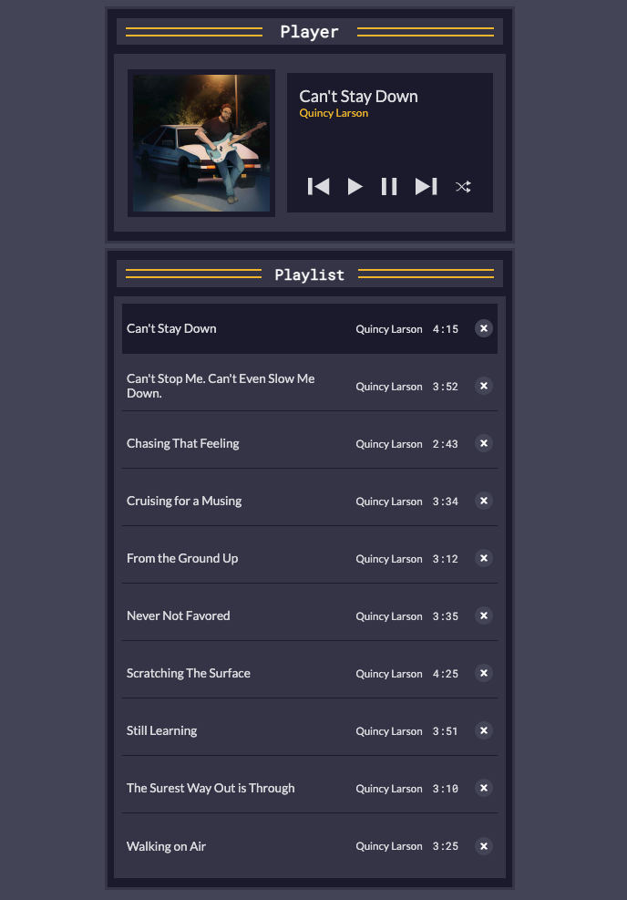

# Music Player

Project Description:

This JavaScript music player project was created as part of my learning journey, following the FreeCodeCamp curriculum. The player allows users to listen to music tracks, navigate through playlists, and control playback functionalities. It was built using HTML, CSS, and JavaScript, and it incorporates modern web development techniques and best practices. Feel free to explore the codebase, contribute, or use it as a learning resource.

Key Features:

Play, pause, and skip tracks
Add/Remove tracks to playlist
Display track metadata such as title, artist, and duration
Support for playlists and track navigation
Responsive design for compatibility across devices

Credits:
This project was inspired by the FreeCodeCamp curriculum and various online resources. Special thanks to the contributors and the open-source community for their valuable contributions and support.

License:
This project is licensed under the BSD 3-Clause License. Feel free to use, modify, and distribute the code for personal and commercial purposes.

